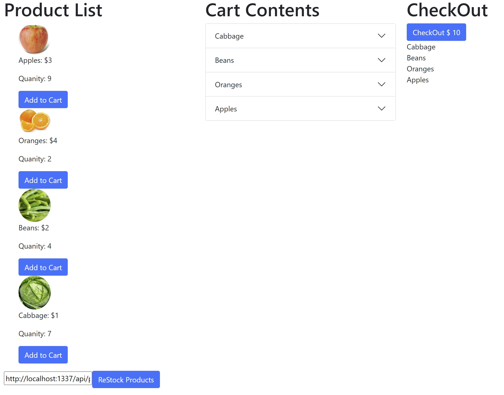

# Shopping-cart-AWS
Here I took my shopping cart app and refactored it to build a static website and deployed it to AWS S3 buckets. This was a week 20 assignment.

 
#### Installation:
 
<<<<<<< HEAD
You could have to get your own AWS account and set up a bucket to put it into, but it would be easier to just check mine out at: https://cart-react-01.s3.amazonaws.com/index.html
=======
You would have to get your own AWS account and set up a bucket to put the contents of the Build folder in you AWS bucket.
>>>>>>> 968b9c7d0cc35e277f9f8a7864103c4da8209d5a
 
#### Usage:
 
Keep track of stock and cost of items.
 
#### Support: 
 
I would just check the website version if you can't get a cloned version to work.
 
#### Roadmap: 
I'd like the website to adjust to the screen size.
 
#### License information:
 
MIT license
